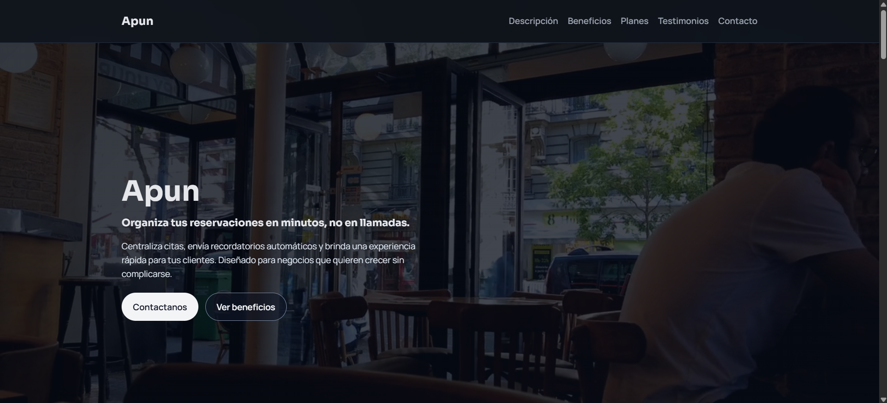

# Apun Project 

## Descripcion general del sitio

**Proposito:**
Presentar una solucion digital para la gestion de reservaciones en negocios, centralizando citas y mejorando la organizacion diaria.

**Publico objetivo:**
- Propietarios de  negocios (aprox. 25 a 50 años) que buscan optimizar sus operaciones sin requerir conocimientos tecnicos avanzados.
- Clientes finales (aprox. 15 a 60 años) que desean reservar servicios de forma rapida y sencilla.

**Alcance:**
El sitio muestra informacion del sistema de reservaciones, sus beneficios, testimonios y un medio de contacto para captar interesados y facilitar el acceso a la plataforma.

## URL

`estebanhrze.github.io/Apun-Project/`

